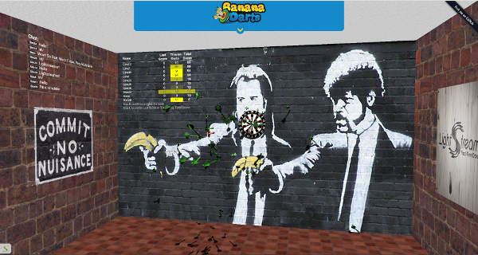
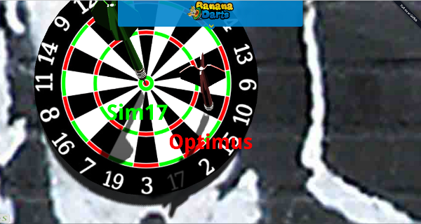
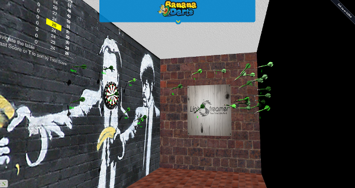

# Lightstreamer - Multiplayer Darts - HTML (LeapJS, Three.js) Client #
<!-- START DESCRIPTION bananadarts-client-javascript -->

Multiplayer, [Leap Motion](https://www.leapmotion.com/) controlled, dart game running in the browser and using 
[Lightstreamer](http://www.lightstreamer.com) for its real-time communication needs. 

[](http://demos.lightstreamer.com/DartsLeapMotion/)<br>
[](http://demos.lightstreamer.com/DartsLeapMotion/)<br>
[](http://demos.lightstreamer.com/DartsLeapMotion/)<br>
An online demonstration is hosted on our servers at: [http://demos.lightstreamer.com/DartsLeapMotion/](http://demos.lightstreamer.com/DartsLeapMotion/)<br>

This application uses the *JavaScript Client API for Lightstreamer* to handle the communications with Lightstreamer Server, *leapjs* to read the users' hand movement through the Leap Motion Controller and
*three.js* to display the users' darts on the browser.

Each user controls a dart (the red one) that can be thrown toward the dartboard in order to score points while seeing how other players are faring (the green darts)

<!-- END DESCRIPTION bananadarts-client-javascript -->

# Build #

The html application can be optionally built, to reduce the number and size of the files to be downloaded by the browser, using [r.js](http://requirejs.org/docs/optimization.html).
A ready-made configuration file for the build process is available in the build_rjs folder of this project.

The build is configured to use [Google Closure compiler](https://code.google.com/p/closure-compiler/) to minify the files. To run it as is you need to download 
[rhino](https://developer.mozilla.org/en-US/docs/Rhino) js.jar file, compiler.jar from the closure compiler project and r.js from RequireJS. You also need a [Java Virtual 
Machine](https://www.java.com/en/download/) installed on your system.

Once ready, from the build_rjs folder, run
```
java -cp compiler.jar;js.jar org.mozilla.javascript.tools.shell.Main r.js -o app.build.js
```

As an alternative it is possible to customize the build file to use [UglifyJS](https://github.com/mishoo/UglifyJS2); in this case it can be built using [node.js](http://nodejs.org/) instead of using the JVM.

# Deploy #

Before you can run this demo some dependencies need to be solved:

-  Lightstreamer JS client is currently hot-linked in the html page: you may want to replace it with a local version and/or to upgrade its version.
-  RequireJS is currently hot-linked in the html page: you may want to replace it with a local version and/or to upgrade its version.
-  jQuery is currently hot-linked in the html page: you may want to replace it with a local version and/or to upgrade its version.
-  leapjs is currently hot-linked in the html page: you may want to replace it with a local version and/or to upgrade its version.
-  three.js is currently hot-linked in the html page: you may want to replace it with a local version and/or to upgrade its version.

You can deploy this demo inside Lightstreamer internal web server or in any other web server.
If you choose the former please create a new folder under <LS_HOME>/pages/ and copy the contents of the src folder of this project there.
The client demo configuration assume that Lightstreamer Server, Lightstreamer Adapters and this client are launched on the same machine.
If you need to targeting a different Lightstreamer server please search this line in js/Constants.js:
```js
SERVER: protocolToUse+"//push.lightstreamer.com",
```
and change it accordingly.

Note that the [DART](https://github.com/Weswit/BananaDarts-LeapMotion-adapter-java) adapters have to be deployed in your local Lightstreamer server instance.

# See Also #

## Lightstreamer Adapter Needed by This Demo Client ##
<!-- START RELATED_ENTRIES -->

* [Lightstreamer - Multiplayer Darts - Java Adapter](https://github.com/Weswit/BananaDarts-adapter-java)

<!-- END RELATED_ENTRIES -->

# Lightstreamer Compatibility Notes #

* Compatible with Lightstreamer JavaScript Client library version 6.1 or newer.
